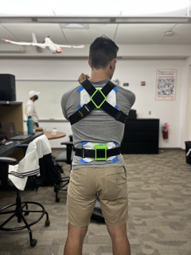

# Baseball Swing Analyzer

## Abstract
Technology is rapidly being integrated into sports to help athletes optimize their movements. This project was developed during a **hackathon** to design and prototype a system for analyzing the biomechanical efficiency of a batter’s swing in real time. By utilizing **Inertial Measurement Units (IMUs)** and **microcontrollers**, the system captures and outputs swing metrics via an **web browser interface**, providing intuitive feedback for users.

The system consists of **two IMUs** connected to a **Raspberry Pi via TCP sockets**. The Raspberry Pi operates as an **ad-hoc network**, allowing users to connect to its IP address and access the swing measurement interface through a **web browser**.

Our system demonstrates an error range of **1 - 3 degrees**, outperforming commercial alternatives like the **WitMotion IMU**. Compared to the high-end **4D Motion Baseball** device, our implementation shows a **9% and 3% difference in maximum rotational velocity** and a **13.6% and 26.6% difference in total rotation for shoulders and hips, respectively**. The goal is to provide an affordable yet effective tool for schools, coaches, parents, and players to improve their game.

## Background
Baseball, like all sports, is evolving with advancements in technology. Various high-end swing analyzers such as **Rapsodo, 4D Motion, and HitTrax** track and measure player performance, but their high cost makes them inaccessible to many teams and athletes. 

This project aims to create a **financially feasible alternative** that maintains accuracy while being accessible to schools and players who otherwise lack access to expensive tools. By providing a level playing field, our solution empowers athletes with data-driven insights to improve their performance.

## System Overview
### **Key Features**
✅ **Real-time Biomechanical Analysis** – Tracks and displays shoulder and hip rotations in real time.
✅ **High Accuracy Sensors** – Uses IMUs with an error range of 1 - 3 degrees.
✅ **Portable & Wearable** – Designed for easy setup and use during batting practice.
✅ **Web-Based Interface** – Users connect to the Raspberry Pi’s ad-hoc network and view swing data via a browser.
✅ **Cost-Effective Alternative** – Offers reliable performance at a fraction of the cost of commercial solutions.

### **Technical Components**
- **Two IMUs** connected to a **Raspberry Pi** via **TCP sockets**.
- **Raspberry Pi as an Ad-Hoc Network**, allowing users to connect wirelessly.
- **Web-based Interface**, accessible through a browser.
- **Real-time Data Visualization** for swing metrics.

## Setup & Usage
1. **Attach the sensor packs** to the batter’s **hip and shoulder**.
2. **Connect to the Raspberry Pi’s ad-hoc network** via a mobile device or laptop.
3. **Open a browser** and navigate to the Raspberry Pi’s IP address.
4. **Start recording swings** – data updates in real time.
5. **Analyze results** using the web interface.

## Performance Comparison
| Metric                     | Our System  | 4D Motion Baseball | Difference |
|----------------------------|------------|--------------------|------------|
| Max Rotational Velocity    | ±9%        | Reference          | 9%         |
| Shoulder Rotation         | ±13.6%     | Reference          | 13.6%      |
| Hip Rotation              | ±26.6%     | Reference          | 26.6%      |

## Future Improvements
🔹 Enhance software algorithms for even greater accuracy.  
🔹 Improve sensor calibration methods.  
🔹 Expand to track additional biomechanical metrics.
🔹 Integrate bluetooth to increase connectivtity efficiency

## Contributions
Developed during a **MLH Hackathon** by the .

---

## 📷 Images & Visuals
### Sensor Pack Setup [shoulders]

### Full Sensor Pack Setup

### Swing Measurement Interface

These images illustrate the wearable **IMU sensor pack** and the **real-time metrics interface** used for swing analysis.

